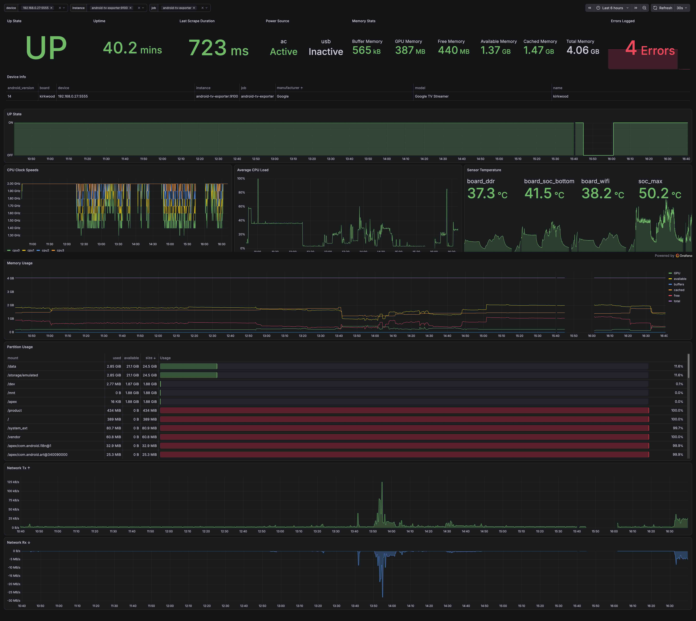
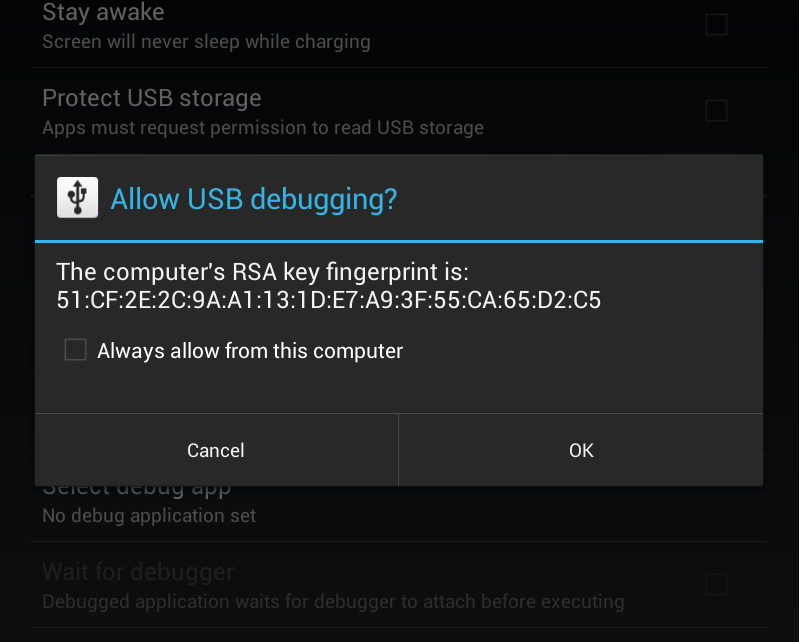

<div align="center">
  
  <h1 style="font-size: 28px; margin: 10px 0;">android-tv-exporter</h1>
  <p>A generic Prometheus exporter for Android TV devices, collected over ADB.</p>
</div>
<br>

It polls stable `/proc` and `/sys` sources on one or more Android TV devices via
the local ADB server and exposes them as Prometheus metrics.

## Features

- **Broad device coverage** — deliberately built around stable, universal
  `/proc`, `/sys`, and `dumpsys` sources, so it works across Android versions
  and manufacturers rather than targeting a single box. No root required.
- **Rich system metrics** — CPU usage (aggregate and per-core), CPU frequency,
  memory, disk usage, thermal zones, network throughput (raw cumulative rx/tx
  byte counters, node_exporter-style), uptime, load average, process counts,
  GPU memory, and power source state.
- **Multi-device** — poll any number of TVs from a single exporter instance.
- **Rootless Docker** — ships a container that runs as a non-root user, with the
  bundled ADB server and configurable UID/GID for clean bind-mount permissions.
- **Tested Grafana dashboard** — includes a ready-to-import dashboard (pictured
  above) verified against a real device.
- **Prometheus-native behavior** — series go gappy when a device is unreachable
  instead of showing stale flat lines, and counters stay monotonic across
  outages so `rate()`/`increase()` just work.

## Install

```sh
uv sync
```

## Usage

```sh
uv run android-tv-exporter --device 192.168.0.27:5555
```

Multiple devices (repeat the flag):

```sh
uv run android-tv-exporter --device 192.168.0.27:5555 --device 192.168.0.42:5555
```

Then scrape `http://localhost:9100/metrics`.

## Configuration

All options can be set via CLI flags or `ANDROIDTV_*` environment variables.
CLI flags take precedence.

| CLI flag                | Env var                               | Default     | Purpose                                    |
| ----------------------- | ------------------------------------- | ----------- | ------------------------------------------ |
| `--adb-host`            | `ANDROIDTV_ADB_HOST`                  | `127.0.0.1` | ADB server host                            |
| `--adb-port`            | `ANDROIDTV_ADB_PORT`                  | `5037`      | ADB server port                            |
| `--device` (repeatable) | `ANDROIDTV_DEVICES` (comma-separated) | none        | Device serials, e.g. `192.168.0.27:5555`   |
| `--listen-host`         | `ANDROIDTV_LISTEN_HOST`               | `0.0.0.0`   | Exporter bind host                         |
| `--listen-port`         | `ANDROIDTV_LISTEN_PORT`               | `9100`      | Exporter bind port (metrics at `/metrics`) |
| `--interval`            | `ANDROIDTV_INTERVAL`                  | `15`        | Poll interval (seconds)                    |
| `--timeout`             | `ANDROIDTV_TIMEOUT`                   | `10`        | Per-device ADB timeout (seconds)           |
| `--log-level`           | `ANDROIDTV_LOG_LEVEL`                 | `INFO`      | Logging verbosity                          |

At least one device is required; the exporter errors and exits otherwise.

## First-time device setup

### 1. Enable network ADB on the TV

On the Android TV:

1. Go to **Settings → System → About** and click **Android TV OS build** (or
   **Build**) seven times to unlock **Developer options**.
2. In **Settings → System → Developer options**, enable **USB debugging** (on
   Google TV this also enables ADB over the network).

Android TV devices — including the Google TV Streamer — listen for ADB on TCP
port **5555** as soon as debugging is enabled, so you can connect directly over
the network at `<ip>:5555`. No USB cable is required.

> The `adb tcpip 5555` command is only needed on devices that _don't_ expose
> network ADB by default (typically phones), where you must bootstrap once over
> USB. Android TV boxes generally skip this step.

Find the TV's IP under **Settings → Network & Internet → (your network)**.

### 2. Authorize the machine (one-time RSA prompt)

The first time an ADB server connects, the TV shows an **"Allow USB debugging?"**
dialog that must be accepted. This ties the TV to that server's key.

**Running under Docker (recommended — bundles ADB):** the container already
includes ADB and runs its own server, so you don't need `adb` installed on your
host.

The container's ADB server generates its own keypair (`adbkey` / `adbkey.pub`) on first start. The TV stores and trusts that public key, so it must be authorized for the container specifically. With the
container running:


```sh
docker compose exec android-tv-exporter adb disconnect 192.168.0.27:5555
docker compose exec android-tv-exporter adb connect 192.168.0.27:5555
```

<div align="center">
  
</div>

Then accept the prompt on the TV. (The `adb disconnect` part is important because if ADB reports "already connected" it will _not_ re-trigger the authorization dialog.)

After accepting the prompt, **restart the container** so the exporter picks up the
now-authorized connection:

```sh
docker compose restart android-tv-exporter
```

> On first boot — before the TV has authorized the container — the logs will show
> `collection failed` / connection errors. This is expected; follow the
> disconnect/connect/accept/restart steps above and the errors will clear.

**Running the CLI directly:** this path expects the `adb` command line tool to be
installed on your host (e.g. `brew install android-platform-tools`, or the
`android-tools-adb` package on Debian/Ubuntu). Then:

```sh
adb connect 192.168.0.27:5555     # accept the prompt on the TV
adb devices                       # should show "device", not "unauthorized"
uv run android-tv-exporter --device 192.168.0.27:5555
```

### Where the ADB keys are stored

The exporter does not manage keys itself; it relies on ADB's default location,
`$HOME/.android/` (`adbkey` / `adbkey.pub`).

- **CLI:** your host user's `~/.android/`.
- **Docker:** `/home/exporter/.android/` inside the container. The Compose file
  mounts this to `./adb-keys/` on the host so the keypair survives container
  recreation and you only authorize the TV once.

## Docker

Build and run with Docker Compose:

```sh
mkdir -p adb-keys          # create the key dir owned by your user first
docker compose up -d --build
```

Set your device serials via the `ANDROIDTV_DEVICES` environment variable in
[docker-compose.yml](docker-compose.yml) (comma-separated). Metrics are served on
`http://localhost:9100/metrics`.

The image bundles `adb` and starts a local ADB server in its entrypoint; the
exporter connects to it and bridges to the TVs over TCP/IP. The ADB keypair is
persisted in the `./adb-keys/` bind mount (mapped to `/home/exporter/.android/`)
so devices don't re-prompt for authorization when the container is recreated. See
[First-time device setup](#first-time-device-setup) for the one-time RSA step.

On Docker Desktop (macOS/Windows) ownership is remapped automatically, so this
usually works with any value.

## Metrics

See [METRICS.md](METRICS.md) for the full list of exported metrics, their labels,
units, sources, and notes. Core metrics come from stable `/proc`, `/sys` and `df`
sources; a few best-effort metrics (temperature, GPU memory, power state) use
`dumpsys` where the stable sources require root.

## Development

```sh
uv sync            # install runtime + dev dependencies
uv run pytest      # run the parser and config tests
uv run ruff check  # lint
```

Parsers live in `src/android_tv_exporter/parsers.py` as pure functions and are
unit-tested against captured fixtures, so new metric parsing can be added and
tested without a device.

## Tested devices

| Device            | Model / board       | Android version | Status  | Notes                                    |
| ----------------- | ------------------- | --------------- | ------- | ---------------------------------------- |
| Google TV Streamer (4K) | board `kirkwood` | Android 14      | ✅ Verified | All exported metrics confirmed live |

Other Android TV devices are expected to work for the core `/proc`, `/sys` and
`df` metrics, which are broadly stable across the Android platform. The
`dumpsys`-based metrics (temperature, GPU memory, power state) are the most likely
to vary — see the roadmap below. If you run this against another device, a PR
adding it to this table (and any device-specific fixtures) is welcome.

## Roadmap / future ideas

So far the exporter deliberately scrapes only **stable** sources: `/proc`, `/sys`
and `df` expose the same fields across Android versions and devices, so their
parsers are portable and safe to rely on.

The `dumpsys` subsystem is a much richer source of metrics (thermal, GPU, power,
display, media, network, and more), but its output format is **not** a stable
contract — it changes between Android versions, vendor HAL implementations, and
even individual devices. Parsing it generically risks silently breaking or
emitting wrong values on hardware we haven't tested.

A possible way to unlock these metrics without sacrificing reliability:

- **Version/device-specific `dumpsys` parsers.** Select a parser implementation
  based on detected properties (e.g. `ro.build.version.sdk`, board, manufacturer)
  so each parser only has to handle output shapes it was actually verified
  against.
- **Captured fixtures per device.** Store real `dumpsys` output as test fixtures
  (as we already do for the stable parsers) so device-specific parsing can be
  unit-tested without the hardware present.
- **Graceful fallback.** When no matching parser is found for a device, skip the
  best-effort metric rather than exporting a guess — keeping the core metrics
  trustworthy everywhere.

Contributions of `dumpsys` captures and parsers for additional devices would be
the main driver here.

## References


Built on these open-source projects:

- [adbutils](https://github.com/openatx/adbutils) — pure-Python ADB client used to
  connect to devices and run shell commands over the ADB server.
- [prometheus-client](https://github.com/prometheus/client_python) — official
  Python client for defining and exposing the Prometheus metrics.
- [Typer](https://github.com/fastapi/typer) — builds the command-line interface.
- [uv](https://github.com/astral-sh/uv) — package and environment management.
- [Ruff](https://github.com/astral-sh/ruff) — linting.

Reference material:

- [Android Debug Bridge (adb)](https://developer.android.com/tools/adb) — official
  ADB documentation.
- [Prometheus exposition format](https://prometheus.io/docs/instrumenting/exposition_formats/)
  — the metrics format served at `/metrics`.
